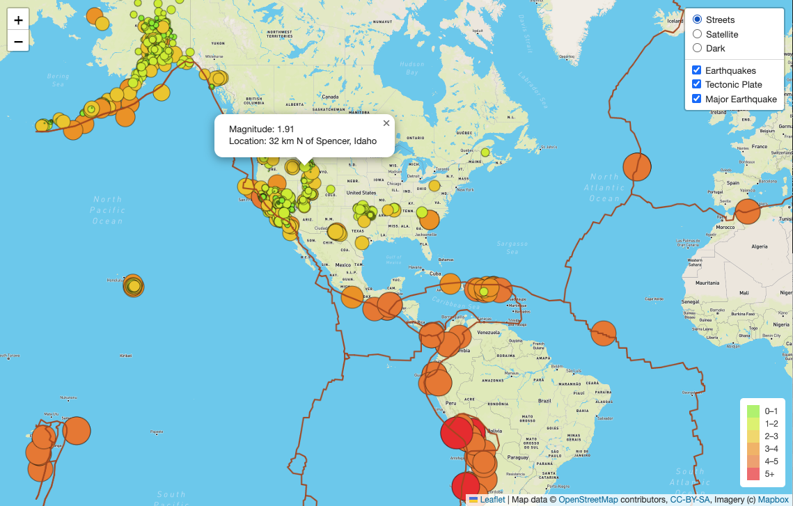
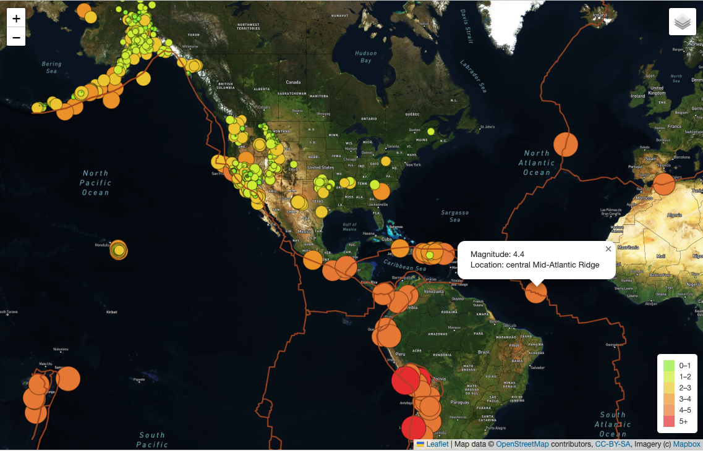
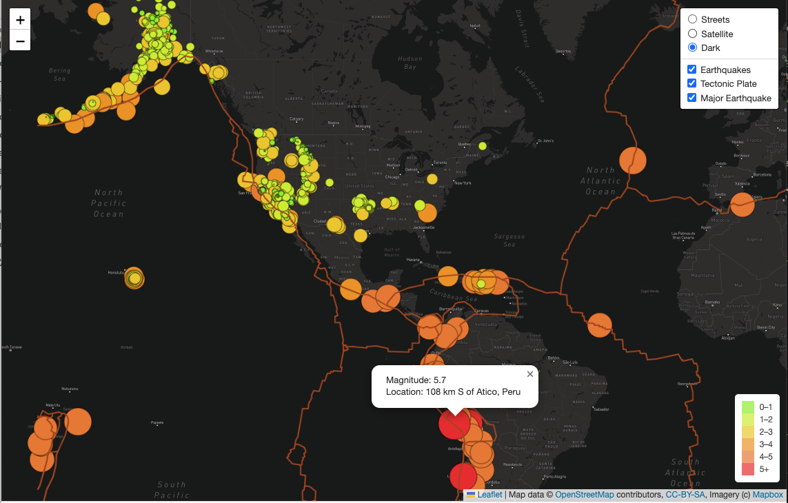

# Mapping_Earthquakes

## Project Overview:
- In this project, we use API calls to Mapbox to visually show with earthquakes informations all over the world. We created a map with three different view modes in dark, street and satellites layer visions. We pull the GeoJson data from USGS webpage to retrieve the earthquake information, especially the magintudes and the places.

## Tools and Data
- Leaflet
- USGS: https://earthquake.usgs.gov/earthquakes/feed/v1.0/summary/4.5_week.geojson
- Github: boundaries: https://github.com/fraxen/tectonicplates/tree/master/GeoJSON

## Map Screenshots

#### Streets layer

#### Satellites layer

#### Dark layer

Interative Page: https://biboking.github.io/Mapping_Earthquakes/
